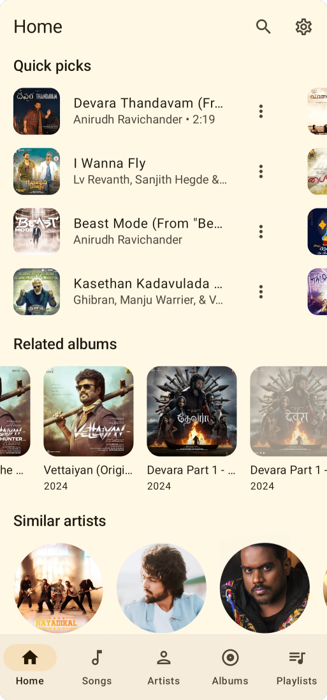

# Music You

An Android application for streaming music from YouTube Music.

## ✨ Features

- Background playback
- Cache songs for offline playback
- Search for songs, albums, artists, videos and playlists
- Bookmark artists and albums
- Import playlists and manage local playlists
- Fetch, display and edit songs lyrics or synchronized lyrics
- Open YouTube and YouTube Music links by default
- Player features, such as sleep timer and persistent queue
- Audio features, such as skip silence and audio normalization
- Other features, such as Android Auto support and invincible service

### 🗒️ New features

- Material You
- Multilingual support
- Quick picks selection customization
- Settings redesign

## 🌐 Available languages

- English
- Tamil

## ℹ️ Disclaimer

This project and its contents are not affiliated with, funded, authorized, endorsed by, or in any
way associated with YouTube, Google LLC or any of its affiliates and subsidiaries.

Any trademark, service mark, trade name, or other intellectual property rights used in this project
are owned by the respective owners.
